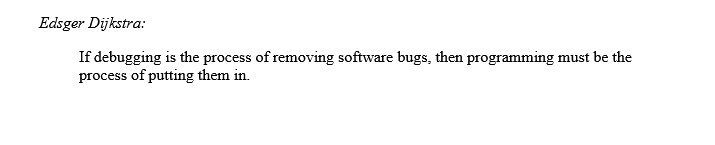

# HTML uses and tricks

## Index

[Home](./README.md)

## Neat way to cite sources

```html
<figure>
  <figcaption><cite>Edsger Dijkstra:</cite></figcaption>
  <blockquote>If debugging is the process of removing software bugs,
  then programming must be the process of putting them in.</blockquote>
</figure>
```

